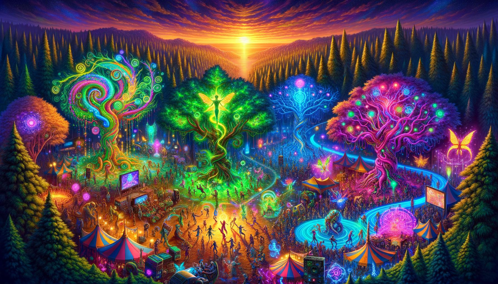
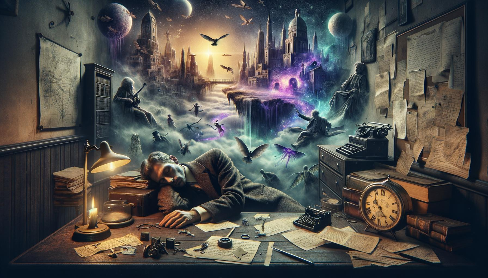

# image_project
 
## Project Notes:

Personal project exploring prompting and "art" generation. Takes randomly-selected concepts ("Baroque", "Portrait"), creates a cohesive "art" prompt incorporating a specific user's likes and dislikes then generates and saves the image

Uses tree-of-thought prompting, experiments with iterative improvement and identities to help guide prompt development.

## Quickstart

- Default config is `config/config.yaml` (`run.mode: prompt_only`) and writes artifacts under `./_artifacts/`.
- Run: `pdm run generate`
- Customize: create `config/config.local.yaml` (deep-merged over the base). Reference: `config/config.full_example.yaml`.

## Step-Driven Prompt Pipeline

The generation workflow is implemented as a small, declarative chat pipeline built from **Steps** (`ChatStep`) and nested **Blocks** (`Block`). Each step records `{name, path, prompt, response, params, created_at}` into a JSON transcript for later inspection.

See `docs/pipeline.md` for the execution model, merge modes, and the ToT/enclave wrapping pattern.

### Prompt Plans + Stage Modifiers

The prompt pipeline is selected by `prompt.plan` and then modified by stage selectors/overrides (include/exclude/temperature/refinement/capture stage). This enables quick experiments without editing orchestration code.

- Docs + examples: `docs/experiments.md`
- Built-in plans live in `image_project/impl/current/plans.py`.
- Stage wiring + prompt builders live in `image_project/impl/current/prompting.py`. See `docs/stages.md`.
- New plans can be added by dropping a module under `image_project/impl/current/plan_plugins/` (no changes to `image_project/app/generate.py` required).

Discoverability helpers:

- List stages: `python -m image_project list-stages` (or `pdm run list-stages`)
- List plans: `python -m image_project list-plans` (or `pdm run list-plans`)

### Hardening behavior (fail-fast + reliable artifacts)

- Pipeline fails fast on `None` / non-string / empty prompts or responses (unless a step explicitly opts into empties via `allow_empty_prompt` / `allow_empty_response`).
- Config booleans are parsed strictly (e.g. `enabled: "false"` is treated as false; invalid values raise with the full key path).
- Image save failures raise and abort the run (no successful run with missing files).
- Transcript JSON is written on success and on failure (once `RunContext` exists). Failed runs include an `error` object with `type`, `message`, `phase`, and optional `step`.
- If `rclone.enabled: true`, `rclone.remote` and `rclone.album` are required (no empty-string fallbacks).
- `ChatStep.temperature` is the only supported way to set temperature (do not pass `"temperature"` inside `ChatStep.params`).

### Legacy code

- Canonical entrypoint: `python -m image_project generate`.
- Canonical orchestration: `image_project/app/generate.py` (`run_generation()`).
- Root `main.py` is a deprecated compatibility shim; older experiments are under `legacy/`.

## Configuration

Config loading:

- Base config: `config/config.yaml`
- Optional local overlay: `config/config.local.yaml` (deep-merged on top; ignored by git)
- Optional env override: set `IMAGE_PROJECT_CONFIG=/abs/path/to/config.yaml` to load a single file (no local overlay)

### Required keys (conditional)

`run.mode: prompt_only` (default):

- Required:
  - `image.log_path`
  - `prompt.categories_path`
  - `prompt.profile_path`
- Optional (validated if present):
  - `image.generation_path`
  - `image.upscale_path`
  - `prompt.generations_path`
  - `prompt.titles_manifest_path`

`run.mode: full`:

- Required:
  - `image.generation_path` (preferred) or `image.save_path` (deprecated alias)
  - `image.log_path`
  - `prompt.categories_path`
  - `prompt.profile_path`
  - `prompt.generations_path`
- Required only when enabled:
  - `upscale.enabled: true` → `image.upscale_path`
  - `rclone.enabled: true` → `rclone.remote` + `rclone.album`

### Optional keys

- `prompt.random_seed` (int): makes concept selection deterministic; if omitted, a seed is generated and logged.
- Prompt plan selection:
  - `prompt.plan: auto|standard|blackbox|refine_only|baseline|simple|profile_only|profile_only_simple`
  - `prompt.refinement.policy: tot|none`
  - `prompt.stages.include` / `prompt.stages.exclude` / `prompt.stages.overrides`
  - `prompt.output.capture_stage`
  - `prompt.refine_only.draft` / `prompt.refine_only.draft_path`
- Concept selection + filtering (preprompt stages):
  - `prompt.concepts.selection.strategy: random|fixed|file`
  - `prompt.concepts.selection.fixed` / `prompt.concepts.selection.file_path`
  - `prompt.concepts.filters.enabled` / `prompt.concepts.filters.order`
  - `prompt.concepts.filters.dislike_rewrite.temperature`
- `prompt.titles_manifest_path` (full mode): defaults to `<image.generation_path>/titles_manifest.csv` (logged at WARNING when defaulted).
- Black-box scoring + selection (default off):
  - Enable with `prompt.scoring.enabled: true`.
  - Generates multiple "idea cards", scores them with a separate LLM judge (numeric JSON only), selects one (epsilon-greedy with optional novelty), and then generates the final prompt.
  - Scoring details are recorded in the transcript under `blackbox_scoring` but are not merged into downstream prompt context.
  - Details: `docs/scoring.md`
- Run labeling (optional):
  - `experiment.id` / `experiment.variant` / `experiment.notes` / `experiment.tags`
  - Recorded in the transcript, `run_review` HTML/JSON, and the run index JSONL.
- `image.caption_font_path`: optional `.ttf` for the caption overlay.
  - If explicitly set and the font cannot be loaded, the run fails loudly (no silent fallback).
- Boolean flags (e.g. `rclone.enabled`, `upscale.enabled`) accept booleans, `0`/`1`, and strings `"true"`/`"false"`/`"1"`/`"0"`/`"yes"`/`"no"` (case-insensitive); other values raise.
- Unknown keys under `prompt.*`, `context.*`, `image.*`, `rclone.*`, `upscale.*`, `experiment.*` produce warnings by default. Set top-level `strict: true` to turn these into errors.
- Context injectors (default off):
  - `context.enabled` (bool): enable/disable context injection (default `false`).
  - `context.injectors` (list[str]): ordered injector names; if omitted while enabled, defaults to `["season", "holiday"]` with a WARNING.
  - `context.injection_location` (string): `system|prompt|both` (default `system`).
  - `context.holiday.lookahead_days` (int), `context.holiday.base_probability` (float), `context.holiday.max_probability` (float).
  - `context.calendar.enabled` (bool): not implemented yet; if set `true`, the run fails fast with a clear `ValueError`.

## Per-Image Identifiers (Seq + Title)

Each generated image is post-processed to add a subtle caption overlay so a viewer can reference images during feedback:

`#042 - Turquoise Citadel` (bottom caption strip)

### Manifest

Each image also appends a row to a CSV manifest so `#NNN` and the title can be resolved back to the underlying generation record.

- Default path: `<image.generation_path>/titles_manifest.csv`
- Override: set `prompt.titles_manifest_path` in `config/config.yaml`

Columns (v1): `seq`, `title`, `generation_id`, `image_prompt`, `image_path`, `created_at`, plus optional metadata like `model`, `size`, `quality`, `title_source`, `title_raw`.

### Sequencing

Sequence numbers are allocated as `max(seq)+1` from the manifest (starts at `1` if missing/empty).

### Failure behavior

Title generation is best-effort: it retries the model a few times, then falls back to a sanitized single-line title (logging the rejected attempts) so the run can continue.

Optional: set `image.caption_font_path` to a `.ttf` file to control the caption font (otherwise common defaults are tried).

## Run Artifacts

- Prompt-only: `<image.log_path>/<generation_id>_final_prompt.txt`
- Image (full mode): `<image.generation_path>/<generation_id>_image.jpg` (and optionally `<generation_id>_image_4k.jpg` when upscaling is enabled).
- Generation CSV (full mode): `prompt.generations_path` with schema `generation_id`, `selected_concepts` (JSON string), `final_image_prompt`, `image_path`, `created_at`, `seed`.
- Transcript JSON: `<image.log_path>/<generation_id>_transcript.json` with keys:
  - `generation_id`, `seed`, `selected_concepts`, `steps`, `image_path`, `created_at`
  - When context injection is enabled, the transcript also includes a `context` object (structured metadata keyed by injector name).
  - The transcript includes a `blackbox_scoring` object (when enabled, includes score/selection metadata).
  - When configured, the transcript includes `experiment: {id, variant, notes, tags}`.
  - The transcript includes `outputs.prompt_pipeline` (requested/resolved plan and resolved stage ids).
- Run index (JSONL): `<image.log_path>/runs_index.jsonl` (one line per run; includes experiment + prompt_pipeline + artifact paths).

## How to run

- Generate (uses `config/config.yaml` + optional `config/config.local.yaml`): `pdm run generate`
- Tests: `pdm run test` (or `pytest`)

## Examples:

### Random Concepts:

['Psychedelic Nature: Nature scenes with a psychedelic, surreal twist.', "Bird's-Eye View: An overhead perspective, offering a comprehensive view from above.", 'Color Field Painting']

### User Profile:

Likes: 

colorful,
vibrant

Dislikes: 
monochromatic colors, 
apocalyptic themes, 
single character focus, 
abstract without clear story, 
horror elements

### Final Prompt:

**Title:** "The Festival of Life"

**Prompt:**
Create a vibrant, fantastical festival set in an enchanted forest from a bird's-eye view. The forest should be alive with swirling, psychedelic colors—vivid greens, deep purples, electric blues, and bright pinks. Depict trees with twisted branches that glow, interwoven with bioluminescent and holographic elements, symbolizing a fusion of nature and technology. 

At the heart of the festival, include a diverse array of mythical creatures like fairies with iridescent wings and centaurs, alongside humans in colorful, flowing garments and futuristic beings such as robots and cyborgs. Show dynamic activities filled with communal joy: a centaur and a cyborg collaborating on an art project, fairies teaching a robot to levitate, and humans engaging in virtual reality experiences with mythical beings. 

The setting sun should cast a warm, golden light over the scene, blending with the vibrant colors and bioluminescent glow to enhance the magical and harmonious atmosphere. The overall mood should be joyful, magical, and thought-provoking, with a sense of wonder and futuristic innovation.

### Style and Color:
Blend surrealism and psychedelia with futuristic elements, featuring intricate details and exaggerated, vibrant colors. Use a color scheme of electric blues, vivid greens, deep purples, bright pinks, and warm golden hues.

### Important Keywords:
Unity, diversity, harmony, communal joy, nature and technology fusion, magical mood, futuristic elements, provocative interactions, bird's-eye view.


### Result



### Random Concepts:

['Whodunit: A classic detective story focusing on solving a crime or mystery.', 'Subjective Perspective: Representing a scene from a subjective point of view, often to convey emotional states.', 'Complementary: Colors opposite each other on the color wheel, offering high contrast and vibrant visuals.']

### User Profile:

Likes:
Minimalist design,
Black and white photography,
Complex narratives,
Historical dramas,
Classical music,

Dislikes:
Bright colors,
Modern pop culture,
Simplistic or superficial themes,
Loud environments,
Fast-paced action movies

### Final Prompt

 Title: The Veil of Dreams

**Visual Description:**
- **Central Scene:** A 1930s detective, dressed in period attire, is asleep at a wooden desk. The desk is cluttered with notes, black-and-white photographs, and old maps, signifying his deep involvement in a mystery. His facial expression reflects a mix of peace and slight unease.
- **Dreamscape Integration:** Above and around the detective, an ethereal dreamscape unfolds. Floating islands, surreal architecture, and mystical creatures in vivid violet and vibrant yellow hues seamlessly merge into the real-world setting. Books float mid-air, spectral figures lurk in shadows, and parts of the dream-like architecture break through the walls and floor, creating a striking, surreal atmosphere.
- **Symbolic Details:** The desk includes a broken clock, scattered keys, and torn pages with cryptic messages, symbolizing hidden truths and fragmented thoughts. Faint, ghostly figures from the dreamscape subtly interact with the real-world elements, further blurring the lines between reality and dreams.
- **Lighting and Shadows:** Dramatic lighting casts stark contrasts and eerie shadows, enhancing the dreamlike and unsettling mood of the scene. Monochromatic tones in shades of brown and sepia dominate the real-world elements, contrasting sharply with the vivid violet and vibrant yellow hues of the dreamscape.
- **Action and Emotion Words:** Asleep, floating, lurking, breaking, hinting, interacting. Peaceful, uneasy, ethereal, vivid, disorienting, surreal, dramatic, eerie, transparent.
- **Art Style:** A blend of realistic and surrealist artistry, with the detective’s environment rendered in a detailed, realistic manner and the dreamscape featuring fluid, abstract forms.

**Narrative and Thematic Symbolism:**
- **Subconscious Exploration:** The detective’s journey into his subconscious, where intuition and imagination guide him through a disorienting blend of reality and dreams. The dreamscape reveals not just fantastical elements but also hidden truths and emotional connections.
- **Emotional and Psychological Tension:** Tension between the conscious mind and subconscious revelations is depicted through the merging of dream elements with reality, creating a sense of disorientation and introspection.

### Result



### Notes:

  Current prompting methods seem to repeatedly hone in on sunset/sunrise and environmental themes. Trees are frequently incorporated. Would be interesting to explore further.

## Future Directions:
- integrate like/dislike mechanism
    - MVP like/dislike input mechanism
    - MVP like/dislike tracking
    - language tracking ("I don't like how it's too dark")
    - language tracking -> like/dislike variables

- Frequency adjustments based on likes/dislikes and recent-ness

- Implement injection of local/current things (date, season, location, etc.)

- Programmatically modify prompt structure and implement variations.
- Implement prompting A/B testing

- Extend black-box scoring (rubrics, novelty heuristics, optional CSV columns)

- automatically generate categories concepts at first install

- Display Frontend

- Integrate with midjourney API when available
    - Automate assessment and selection of upscaling/variation images

## 4K Upscaling (Optional)

This project can optionally run a post-processing step to upscale the generated
image to a "4K" long-edge target (default: 3840px) using the open-source
Real-ESRGAN NCNN Vulkan portable executable.

### Install Real-ESRGAN (NCNN Vulkan)

1. Download the portable executable for your OS from the Real-ESRGAN project:
   https://github.com/xinntao/Real-ESRGAN

2. It's easiest to download the OS executable (middle of README page, not a release) 
   because it includes the models. If not download the model files (param/bin) and 
   place them in a `models` directory next to the executable, or provide an 
   explicit `model_path` in config/CLI.

3. Ensure the binary can be found by the project by doing one of:
   - Put it on your PATH (so `realesrgan-ncnn-vulkan` is executable), OR
   - Set environment variable `REALESRGAN_NCNN_VULKAN_PATH` to the full path,
     OR
   - Set `upscale.realesrgan_binary` in config.

Note: The Vulkan backend generally requires a Vulkan-compatible GPU.

### Configure

Output sizing is configurable in two ways:
- Preferred: set `upscale.target_aspect_ratio` (e.g., `"16:9"`) plus `target_long_edge_px`. The final resize uses a center-crop to fit the requested ratio (no stretching).
- Explicit size: set both `upscale.target_width_px` and `upscale.target_height_px` to force an exact output size (overrides aspect ratio/long edge).

Add an `upscale` section to your config (example YAML):

```yaml
upscale:
  enabled: true
  target_long_edge_px: 3840
  target_aspect_ratio: "16:9"  # default in config/config.yaml
  # target_width_px: 3840      # optional exact sizing (must set both width/height)
  # target_height_px: 2160
  engine: realesrgan-ncnn-vulkan
  # Optional. If omitted, PATH + REALESRGAN_NCNN_VULKAN_PATH are checked.
  realesrgan_binary: null
  # Optional. Directory containing the *.param/*.bin model files.
  model_path: null
  model_name: realesrgan-x4plus
  tile_size: 0
  tta: false
  # If true and Real-ESRGAN isn't available, fall back to a Lanczos resize.
  # Default is false (fail loudly).
  allow_fallback_resize: false
```

When enabled, the script saves an additional file named:

`<generation_id>_image_4k.jpg`

### Manual Upscaling CLI

To manually test upscaling on any image, use the helper script:

```
python scripts/manual_upscale.py path/to/image.jpg
```

- Writes the result next to the input as `image_4k.jpg` (same extension preserved).
- Defaults to a 3840px long edge and uses the configured aspect ratio (config defaults to 16:9); override with `--target-long-edge`, `--target-aspect-ratio`, or explicit `--target-width/--target-height`.
- Provide a custom Real-ESRGAN binary with `--realesrgan-binary /path/to/realesrgan-ncnn-vulkan`.
- Provide a custom models directory with `--model-path /path/to/models` (folder containing *.param/*.bin).

## Google Photos Upload (Optional)

This project can optionally upload the final output image to Google Photos after
generation using `rclone`.

Full setup (including creating your own Google OAuth client to avoid shared-quota
issues) is documented in `docs/rclone-google-photos.md`.

### Configure

Add a `rclone` section to your config (example YAML):

```yaml
rclone:
  enabled: true
  remote: gphotos_personal
  album: The Day's Art
```

When enabled, the script runs:

`rclone copy <image_path> <remote>:album/<album>`

Notes:
- Upload is best-effort: failures are logged and the run continues (image remains on disk).
- If upscaling is enabled, the upscaled `<generation_id>_image_4k.jpg` is uploaded; otherwise `<generation_id>_image.jpg` is uploaded.
