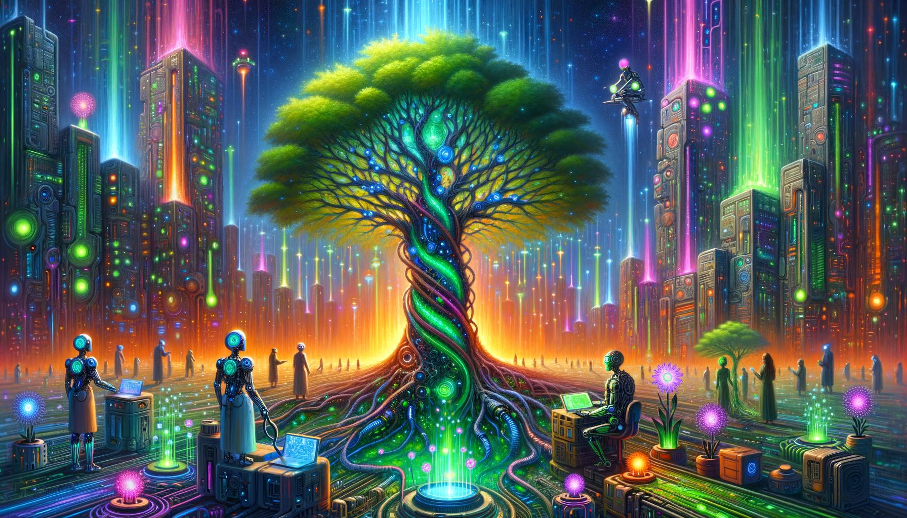

# image_project
 
## Project Notes:

Personal project exploring prompting and "art" generation. Takes randomly-selected concepts ("Baroque", "Portrait"), creates a cohesive "art" prompt incorporating a specific user's likes and dislikes then generates and saves the image

Uses tree-of-thought prompting, experiments with iterative improvement and identities to help guide prompt development.

## Examples:

### Random Concepts:

['Psychedelic Nature: Nature scenes with a psychedelic, surreal twist.', "Bird's-Eye View: An overhead perspective, offering a comprehensive view from above.", 'Color Field Painting']

### User Profile:

Likes: 

colorful,
vibrant

Dislikes: 
monochromatic colors, 
apocalyptic themes, 
single character focus, 
abstract without clear story, 
horror elements

### Final Prompt:

**Title:** "The Festival of Life"

**Prompt:**
Create a vibrant, fantastical festival set in an enchanted forest from a bird's-eye view. The forest should be alive with swirling, psychedelic colors—vivid greens, deep purples, electric blues, and bright pinks. Depict trees with twisted branches that glow, interwoven with bioluminescent and holographic elements, symbolizing a fusion of nature and technology. 

At the heart of the festival, include a diverse array of mythical creatures like fairies with iridescent wings and centaurs, alongside humans in colorful, flowing garments and futuristic beings such as robots and cyborgs. Show dynamic activities filled with communal joy: a centaur and a cyborg collaborating on an art project, fairies teaching a robot to levitate, and humans engaging in virtual reality experiences with mythical beings. 

The setting sun should cast a warm, golden light over the scene, blending with the vibrant colors and bioluminescent glow to enhance the magical and harmonious atmosphere. The overall mood should be joyful, magical, and thought-provoking, with a sense of wonder and futuristic innovation.

### Style and Color:
Blend surrealism and psychedelia with futuristic elements, featuring intricate details and exaggerated, vibrant colors. Use a color scheme of electric blues, vivid greens, deep purples, bright pinks, and warm golden hues.

### Important Keywords:
Unity, diversity, harmony, communal joy, nature and technology fusion, magical mood, futuristic elements, provocative interactions, bird's-eye view.

### Result

### Random Concepts:

['Whodunit: A classic detective story focusing on solving a crime or mystery.', 'Subjective Perspective: Representing a scene from a subjective point of view, often to convey emotional states.', 'Complementary: Colors opposite each other on the color wheel, offering high contrast and vibrant visuals.']

### User Profile:

Likes:
Minimalist design,
Black and white photography,
Complex narratives,
Historical dramas,
Classical music,

Dislikes:
Bright colors,
Modern pop culture,
Simplistic or superficial themes,
Loud environments,
Fast-paced action movies

### Final Prompt

 Title: The Veil of Dreams

**Visual Description:**
- **Central Scene:** A 1930s detective, dressed in period attire, is asleep at a wooden desk. The desk is cluttered with notes, black-and-white photographs, and old maps, signifying his deep involvement in a mystery. His facial expression reflects a mix of peace and slight unease.
- **Dreamscape Integration:** Above and around the detective, an ethereal dreamscape unfolds. Floating islands, surreal architecture, and mystical creatures in vivid violet and vibrant yellow hues seamlessly merge into the real-world setting. Books float mid-air, spectral figures lurk in shadows, and parts of the dream-like architecture break through the walls and floor, creating a striking, surreal atmosphere.
- **Symbolic Details:** The desk includes a broken clock, scattered keys, and torn pages with cryptic messages, symbolizing hidden truths and fragmented thoughts. Faint, ghostly figures from the dreamscape subtly interact with the real-world elements, further blurring the lines between reality and dreams.
- **Lighting and Shadows:** Dramatic lighting casts stark contrasts and eerie shadows, enhancing the dreamlike and unsettling mood of the scene. Monochromatic tones in shades of brown and sepia dominate the real-world elements, contrasting sharply with the vivid violet and vibrant yellow hues of the dreamscape.
- **Action and Emotion Words:** Asleep, floating, lurking, breaking, hinting, interacting. Peaceful, uneasy, ethereal, vivid, disorienting, surreal, dramatic, eerie, transparent.
- **Art Style:** A blend of realistic and surrealist artistry, with the detective’s environment rendered in a detailed, realistic manner and the dreamscape featuring fluid, abstract forms.

**Narrative and Thematic Symbolism:**
- **Subconscious Exploration:** The detective’s journey into his subconscious, where intuition and imagination guide him through a disorienting blend of reality and dreams. The dreamscape reveals not just fantastical elements but also hidden truths and emotional connections.
- **Emotional and Psychological Tension:** Tension between the conscious mind and subconscious revelations is depicted through the merging of dream elements with reality, creating a sense of disorientation and introspection.

### Result

### Notes:

  Current prompting methods seem to repeatedly hone in on sunset/sunrise and environmental themes. Trees are frequently incorporated. Would be interesting to explore further.

## Future Directions:
- integrate like/dislike mechanism
    - MVP like/dislike input mechanism
    - MVP like/dislike tracking
    - language tracking ("I don't like how it's too dark")
    - language tracking -> like/dislike variables

- Frequency adjustments based on likes/dislikes and recent-ness

- Implement injection of local/current things (date, season, location, etc.)

- Programmatically modify prompt structure and implement variations.
- Implement prompting A/B testing

- integrate grading mechanism based on how well it aligns with the selected concepts and additional requirements

- automatically generate categories concepts at first install

- Display Frontend

- Integrate with midjourney API when available
    - Automate assessment and selection of upscaling/variation images
