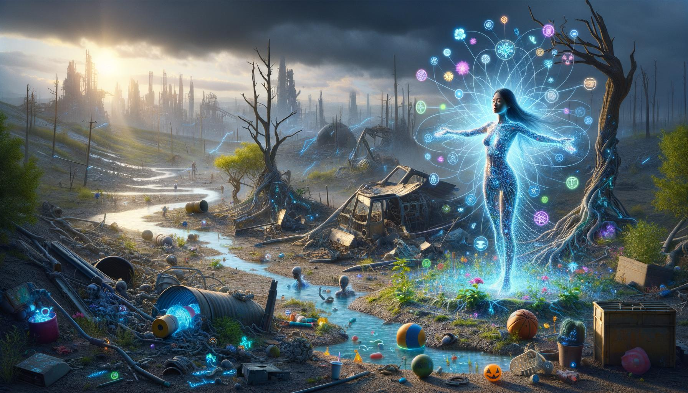

# image_project
 
# Project Notes:

Personal project exploring prompting and "art" generation. Takes randomly-selected concepts ("Baroque", "Portrait"), creates a cohesive "art" prompt incorporating a specific user's likes and dislikes then generates and saves the image

Uses tree-of-thought prompting, experiments with iterative improvement and identities to help guide prompt development.

## Examples:

### Random Concepts:

['Psychedelic Nature: Nature scenes with a psychedelic, surreal twist.', "Bird's-Eye View: An overhead perspective, offering a comprehensive view from above.", 'Color Field Painting']

### User Profile:

Likes: 

colorful,
vibrant

Dislikes: 
monochromatic colors, 
apocalyptic themes, 
single character focus, 
abstract without clear story, 
horror elements

### Result

### Random Concepts:

['Futuristic Healer: A story about a medical professional in the future with advanced technology.', 'Eye-Level: The most natural perspective, replicating human sight line, relatable and straightforward.', 'Triadic: Using three colors evenly spaced around the color wheel, creating a dynamic and balanced palette.']

### User Profile:

Likes:
Minimalist design,
Black and white photography,
Complex narratives,
Historical dramas,
Classical music,

Dislikes:
Bright colors,
Modern pop culture,
Simplistic or superficial themes,
Loud environments,
Fast-paced action movies

### Result

# Future Directions:
- integrate like/dislike mechanism
    - MVP like/dislike input mechanism
    - MVP like/dislike tracking
    - language tracking ("I don't like how it's too dark")
    - language tracking -> like/dislike variables

- Frequency adjustments based on likes/dislikes and recent-ness

- Implement injection of local/current things (date, season, location, etc.)

- Programmatically modify prompt structure and implement variations.
- Implement prompting A/B testing

- integrate grading mechanism based on how well it aligns with the selected concepts and additional requirements

- automatically generate categories concepts at first install

- Display Frontend

- Integrate with midjourney API when available
    - Automate assessment and selection of upscaling/variation images
